# Challenge Conversor de Moneda

## Acerca de.

La aplicación consiste en una aplicacion de back-end en el cual por medio de una API nos conectamos a dicha API y extraemos la información de el valor o tasa actual de la moneda de diferentes tipos de paises.

El iniciar la aplicación, en esta se mostrará un menú en el cúal el usuario podra seleccionar la opción que el quiera, entre las primeras opciones se encontrará las **conversiones de moneda**, una local otra de otro país para demostrar el correcto funcionamiento con la conexón de la API. Las demás opciones son extra las cuales una de ellas es, **ver todas las tasas o valores actuales de monedas** y la otra es **buscar algun valor o tasa actual de moneda**. La aplicación no cuenta con interfaz grafica de estilo front-end sino que la interfaz es por medio de la consola, sin embargo el proposito de este challenge es desmotrar los conocimientos adquiridos con Java y simular una aplicación de estilo back-end.

## Tecnologias utilizadas.
* ### Java - JDK 11
* ### Gson 2.10
* ### API - ExchangeRate-API

## Funcionamiento.
1. **Conversión de Dolar a Pesos Mexicanos (moneda local)**: Al elegir la siguiente opción lo que se le preguntará al usuario, es la cantidad a ingresar para ser transformada a la moneda que ya se tenga seleccionada. Cabe mencionar que al realizar la conversion se le muestra al usuario tambien el valor actual de la moneda. 

2. **Conversión invertida de moneda**: Esta opción funciona de la misma manera que la anterior solo la conversión seria de pesos mexicanos a dolares. Cabe mencionar que al realizar la conversion se le muestra al usuario tambien el valor actual de la moneda. 

3. **Conversión de Dolar a Real Brasileño**: Al elegir la siguiente opción lo que se le preguntará al usuario, es la cantidad a ingresar para ser transformada a la moneda que ya se tenga seleccionada. Cabe mencionar que al realizar la conversion se le muestra al usuario tambien el valor actual de la moneda. 

4. **Visualizacion de tasas de monedas actuales**: Al selecionar esta opción lo que sucede es que la aplicación hace una llamada a la API para mostrar todas las tasas de moendas que tiene la API con su valor actual.

5. **Buscar algun valor de moneda**: Al seleccionar esta opción lo que se le pide al usuario es que ingrese como texto las iniciales de moneda que desea buscar y en caso de estar dichas iniciales en la API esta le da el valor actual.

## Ejemplo.
En la siguiente imagen podemos observar como se ve la aplicación al final. 
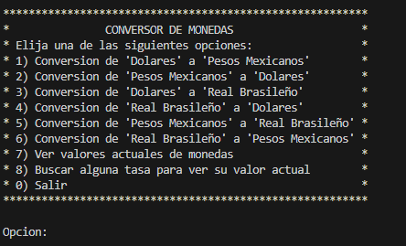

Si seleccionamos por ejemplo la primera opción se le pregunta al usuario la cantidad que desea convertir a la moneda selecionada; en este caso pesos mexicanos.

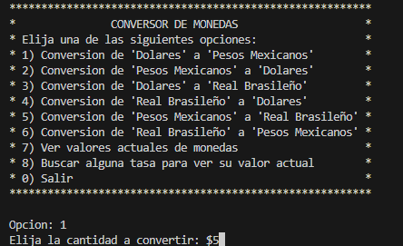

Al elegir uan cantidad valida, la aplicación hace una llamada a la API donde busca el valor de moneda de pesos mexicanos en el archivo json de la API y obteniendo el valor realizamos la conversion de dolares a pesos mexicanos para este ejemplo.
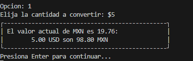

Para verificar nuestra información buscamos dicha conversion con google. Y podemos ver que la información se acerca a lo que rescata nuestra API, esto depende de la herramienta que utilice google para dar su información, cabe señalar que dicha información corresponde a la fecha: **18/04/2025**.

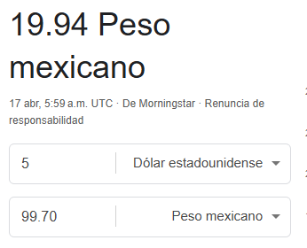

Al presionar **"enter"** nos devuelve al menu, ahora probemos la conversion inversa de pesos a dolares.
Pongamos la misma cantidad que nos devolvio la aplicación, por lo cual la cantidad en dolares deberian ser $5.
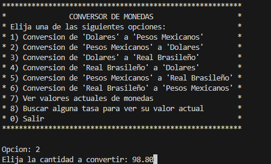

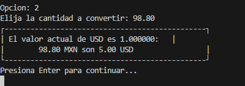

Probemos una ultima conversión, ahora de pesos mexicanos a real brasileño.

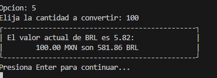

Ahora veamos todos los valores de las tasas de monedas actuales; 'como muestra una lista amplia solo mostrare algunas para el ejemplo'.
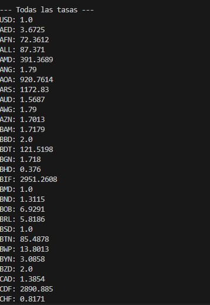

Ahora busquemos algun valor de moneda que queramos, para este ejemplo busquemos el yen; moneda de Japon.
Cabe resaltar que **no importa si se escribe con mayusculas o minusculas el nombre corto de moneda, este lo encontrará si lo tiene en la API**, la unica manera en que no encontrara el valor de la moneda es haberse escrito mal. 

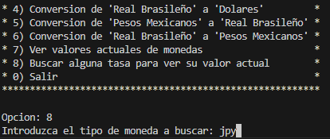

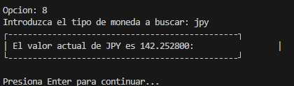

## Validaciones.

1. **Cantidades negativas**: Una de las primeras validaciones en cualquiera de las opciones es verificar que no se haya ingresado alguna cantidad negativa, 0 es permitdo pero una cantidad negativa no.

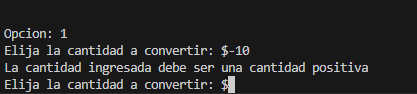

2. **Entradas de texto en lugar de cantidad numerica**: Otra de las validaciones en la aplicacion en las opciones de conversion es validar que no se ingrese texto en lugar de una cantidad numerica.

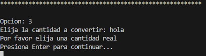

3. **Conexion a API**: Al ser una API gratuita, tiene sus limitaciones por ejemplo cierto tiempo de uso o cantidad de peticiones de la API, asi que si no se renueva la API o se diera el caso que se cae la pagina donde se encuentra la API, la app le notificara al usuario de que **No pudo establecer conexión con la API y no puede hacer la converión o dar los valores de monedas**.

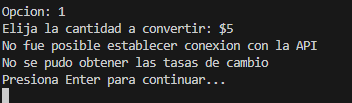

4. **Busqueda de alguna moneda**: Al buscar una moneda una de las validaciones es la manera escrita en como se escriba la moneda a elegir ya sea minuscula o mayuscula. **El unico caso donde no encontrara el valor es si no esta en la API o se escribe mal**.

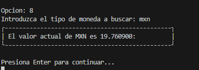

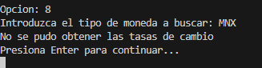

5. **Opción valida en menu**: La validación en el menu esta presente tambien si selecciona otra opción diferente a las presentadas se le notificara al usuario.

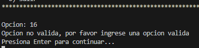

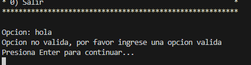

**NOTA: el unico texto permitido como opcional es la palabra "salir" en caso de no querer usar 0**